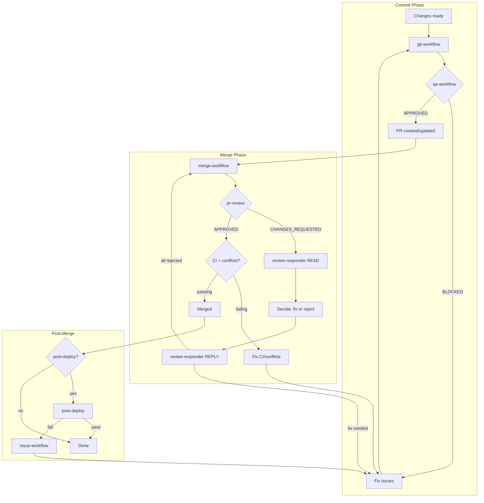

# Workflow Chain (Required)

After completing ANY implementation work that changes files, you MUST follow this workflow chain.

## Core Workflow (Happy Path)

```
1. issue-workflow  → Create/find issue (returns #123)
2. [implementation] → Make the changes
3. git-workflow    → AUTO-RUNS qa-workflow, then commit/branch/PR (requires #123, returns PR #)
4. merge-workflow  → AUTO-RUNS pr-review, then merge (verifies CI, conflicts)
5. post-deploy     → (if configured) Production verification
```

**Self-enforcing:** git-workflow automatically invokes qa-workflow (if configured) before any git operations. merge-workflow automatically invokes pr-review (if configured) before merging. You cannot skip these steps.

## Automatic Triggers

| After completing...          | MUST invoke...         | With input...         |
| ---------------------------- | ---------------------- | --------------------- |
| Plan approval / user request | `issue-workflow`       | Plan/description      |
| File edits/creates           | `git-workflow`         | Issue #               |
| PR creation/update           | `merge-workflow`       | PR #                  |
| Changes requested by review  | Follow Review-Fix Loop | Issue # (existing PR) |
| CI failures blocking merge   | Follow Review-Fix Loop | Issue # (existing PR) |
| Merge conflicts              | Follow Review-Fix Loop | Issue # (existing PR) |
| Successful merge             | `post-deploy`          | Deployment context    |

## Auto-Invoked Agents

These agents are **automatically invoked** by their parent agents. You do NOT need to call them separately.

| Agent         | Auto-invoked by  | When                        | If not configured |
| ------------- | ---------------- | --------------------------- | ----------------- |
| `qa-workflow` | `git-workflow`   | Before any git operations   | Skipped silently  |
| `pr-review`   | `merge-workflow` | Before any merge operations | Skipped silently  |

## Optional Agents (Manual)

These agents are NOT auto-invoked. Check before invoking; skip if not configured.

| Agent         | When to use                    | If not configured |
| ------------- | ------------------------------ | ----------------- |
| `post-deploy` | After merge, production verify | Skip              |

## Agent Invocation

Use Task tool with agent name:

```
Task(subagent_type="issue-workflow", prompt="Create issue for: <description>")
Task(subagent_type="git-workflow", prompt="Commit changes for #<issue-number>")     # auto-runs qa-workflow
Task(subagent_type="review-responder", prompt="Read comments on PR #<pr-number>")   # if comments exist
Task(subagent_type="review-responder", prompt="Reply to PR #<pr-number>: <decisions>")
Task(subagent_type="review-responder", prompt="Resolve threads on PR #<pr-number>: <thread-ids>")
Task(subagent_type="merge-workflow", prompt="Merge PR #<pr-number>")                # auto-runs pr-review
Task(subagent_type="post-deploy", prompt="Validate deployment for #<issue-number>") # if configured
```

**Note:** You do NOT need to invoke `qa-workflow` or `pr-review` directly. They are auto-invoked by `git-workflow` and `merge-workflow` respectively.

## Review-Fix Loop

When blocked, follow this flow:



**Note:** qa-workflow and pr-review are auto-invoked. You don't call them directly.

**Loop Prevention:** Maximum **3 review cycles** per PR. After 3 cycles, stop and report to user.

## Handling Block Reasons

### qa-workflow BLOCKED (from git-workflow)

1. Read the blocking issues from git-workflow output
2. Fix the issues (tests, lint, format, etc.)
3. `git-workflow` → auto-runs qa-workflow again
4. Repeat until qa-workflow APPROVED

### CHANGES_REQUESTED (from merge-workflow via pr-review)

> **NEVER skip step 3.** Even if rejecting all comments, REPLY documents decisions in PR history.

1. `review-responder` READ → returns comments
2. Main agent decides fix/reject for each (has conversation context)
3. `review-responder` REPLY → posts acknowledgments/rejections **(REQUIRED)**
4. If all rejected → retry `merge-workflow` (pr-review may approve)
5. Fix the issues marked for fixing
6. `git-workflow` → auto-runs qa-workflow, pushes to existing PR
7. `review-responder` RESOLVE → resolves threads
8. `merge-workflow` → auto-runs pr-review again

### CI FAILING (from merge-workflow)

1. `review-responder` READ → skips if no comments
2. Check failures: `gh pr checks <PR#>`
3. Fix the failing tests/linting
4. `git-workflow` → auto-runs qa-workflow, pushes fix
5. Wait for CI, then `merge-workflow` → auto-runs pr-review

### MERGE CONFLICTS (from merge-workflow)

1. `review-responder` READ → skips if no comments
2. Rebase or merge main into branch
3. Resolve conflicts
4. `git-workflow` → auto-runs qa-workflow, pushes resolution
5. `merge-workflow` → auto-runs pr-review, retry merge

## NEVER Stop After

- Completing implementation without committing
- Creating a PR without offering review/merge
- Getting PR approval without offering to merge
- Receiving CHANGES_REQUESTED without addressing issues
- Merge blocked by CI without investigating
- Post-deploy failure without creating fix issue

## Example: Happy Path (qa-workflow + pr-review configured)

```
User: "Add dark mode support"

1. Task(issue-workflow) → #42
2. [Implement - edit files]
3. Task(git-workflow, "for #42")
   → auto-runs qa-workflow → APPROVED
   → commits, creates PR #85
4. Task(merge-workflow, "PR #85")
   → auto-runs pr-review → APPROVED
   → merges, deletes branch, closes #42
```

## Example: qa-workflow blocks commit

```
1. Task(issue-workflow) → #42
2. [Implement - edit files]
3. Task(git-workflow, "for #42")
   → auto-runs qa-workflow → BLOCKED (tests failing)
   → returns blocking issues, NO commit made
4. [Fix failing tests]
5. Task(git-workflow, "for #42")
   → auto-runs qa-workflow → APPROVED
   → commits, creates PR #85
6. Task(merge-workflow, "PR #85") → Merged
```

## Example: pr-review requests changes

```
1. Task(issue-workflow) → #50
2. [Implement]
3. Task(git-workflow, "for #50") → qa-workflow APPROVED → PR #90
4. Task(merge-workflow, "PR #90")
   → auto-runs pr-review → CHANGES_REQUESTED
   → returns review comments, NO merge
5. Task(review-responder, "Read PR #90") → 2 comments
6. Main agent decides: comment 1 fix, comment 2 reject
7. Task(review-responder, "Reply PR #90: fix 1, reject 2 reason")
8. [Fix issue 1]                              ← Cycle 1
9. Task(git-workflow, "for #50")
   → auto-runs qa-workflow → APPROVED
   → pushes to existing PR #90
10. Task(review-responder, "Resolve PR #90 threads")
11. Task(merge-workflow, "PR #90")
    → auto-runs pr-review → APPROVED
    → merges
```
