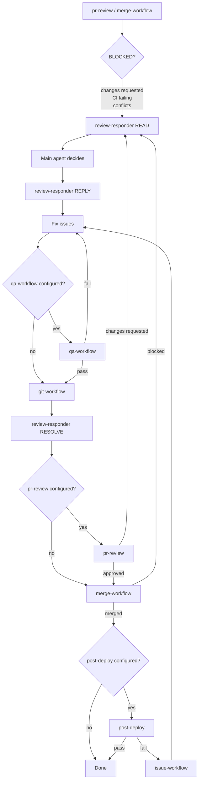

# Workflow Chain (Required)

After completing ANY implementation work that changes files, you MUST follow this workflow chain.

## Core Workflow (Happy Path)

```
1. issue-workflow  → Create/find issue (returns #123)
2. [implementation] → Make the changes
3. qa-workflow     → (if configured) Pre-commit validation (tests, lint)
4. git-workflow    → Commit, branch, PR (requires #123, returns PR #)
5. pr-review       → (if configured) Code review
6. merge-workflow  → Merge when approved (verifies CI, conflicts)
7. post-deploy     → (if configured) Production verification
```

## Automatic Triggers

| After completing...           | MUST invoke...                | With input...         |
| ----------------------------- | ----------------------------- | --------------------- |
| Plan approval / user request  | `issue-workflow`              | Plan/description      |
| File edits/creates            | `qa-workflow` (if configured) | Issue #               |
| Pre-commit validation         | `git-workflow`                | Issue #               |
| PR creation/update            | `pr-review` (if configured)   | PR #                  |
| PR approval (all checks pass) | `merge-workflow`              | PR #                  |
| Changes requested by review   | Follow Review-Fix Loop        | Issue # (existing PR) |
| CI failures blocking merge    | Follow Review-Fix Loop        | Issue # (existing PR) |
| Merge conflicts               | Follow Review-Fix Loop        | Issue # (existing PR) |
| Successful merge              | `post-deploy` (if configured) | Deployment context    |

## Optional Agents

These agents may not exist in all repositories. Check before invoking; skip if not configured.

| Agent         | When to use                         | If not configured      |
| ------------- | ----------------------------------- | ---------------------- |
| `qa-workflow` | After implementation, before commit | Skip to git-workflow   |
| `pr-review`   | After PR creation, before merge     | Skip to merge-workflow |
| `post-deploy` | After merge, production verify      | Skip                   |

## Agent Invocation

Use Task tool with agent name:

```
Task(subagent_type="issue-workflow", prompt="Create issue for: <description>")
Task(subagent_type="qa-workflow", prompt="Validate changes for #<issue-number>")    # if configured
Task(subagent_type="git-workflow", prompt="Commit changes for #<issue-number>")
Task(subagent_type="pr-review", prompt="Review PR #<pr-number>")                    # if configured
Task(subagent_type="review-responder", prompt="Read comments on PR #<pr-number>")   # if comments exist
Task(subagent_type="review-responder", prompt="Reply to PR #<pr-number>: <decisions>")
Task(subagent_type="review-responder", prompt="Resolve threads on PR #<pr-number>: <thread-ids>")
Task(subagent_type="merge-workflow", prompt="Merge PR #<pr-number>")
Task(subagent_type="post-deploy", prompt="Validate deployment for #<issue-number>") # if configured
```

## Review-Fix Loop

When blocked, follow this flow:



**Loop Prevention:** Maximum **3 review cycles** per PR. After 3 cycles, stop and report to user.

## Handling Block Reasons

### CHANGES_REQUESTED (from pr-review)

1. `review-responder` READ → returns comments
2. Main agent decides fix/reject for each (has conversation context)
3. `review-responder` REPLY → posts acknowledgments/rejections
4. Fix the issues marked for fixing
5. `qa-workflow` (if configured)
6. `git-workflow` → pushes to existing PR
7. `review-responder` RESOLVE → resolves threads
8. `pr-review` (if configured)
9. If approved → `merge-workflow`

### CI FAILING (from merge-workflow)

1. `review-responder` READ → skips if no comments
2. Check failures: `gh pr checks <PR#>`
3. Fix the failing tests/linting
4. `qa-workflow` (if configured)
5. `git-workflow` → pushes fix
6. `pr-review` (if configured)
7. Wait for CI, then `merge-workflow`

### MERGE CONFLICTS (from merge-workflow)

1. `review-responder` READ → skips if no comments
2. Rebase or merge main into branch
3. Resolve conflicts
4. `qa-workflow` (if configured)
5. `git-workflow` → pushes resolution
6. `pr-review` (if configured)
7. `merge-workflow` → retry

## NEVER Stop After

- Completing implementation without committing
- Creating a PR without offering review/merge
- Getting PR approval without offering to merge
- Receiving CHANGES_REQUESTED without addressing issues
- Merge blocked by CI without investigating
- Post-deploy failure without creating fix issue

## Example: Minimal (no optional agents)

```
User: "Add dark mode support"

1. Task(issue-workflow) → #42
2. [Implement - edit files]
3. Task(git-workflow, "for #42") → PR #85
4. Task(merge-workflow, "PR #85") → Merged
```

## Example: With pr-review configured

```
1. Task(issue-workflow) → #42
2. [Implement - edit files]
3. Task(git-workflow, "for #42") → PR #85
4. Task(pr-review, "PR #85") → APPROVED
5. Task(merge-workflow, "PR #85") → Merged
```

## Example: Review requests changes (pr-review configured)

```
1. Task(issue-workflow) → #50
2. [Implement]
3. Task(git-workflow, "for #50") → PR #90
4. Task(pr-review, "PR #90") → CHANGES_REQUESTED
5. Task(review-responder, "Read PR #90") → 2 comments
6. Main agent decides: comment 1 fix, comment 2 reject (intentional)
7. Task(review-responder, "Reply PR #90: fix 1, reject 2 reason")
8. [Fix issue 1]                          ← Cycle 1
9. Task(git-workflow, "for #50") → Pushed to PR #90
10. Task(review-responder, "Resolve PR #90 threads")
11. Task(pr-review, "PR #90") → APPROVED
12. Task(merge-workflow, "PR #90") → Merged
```
