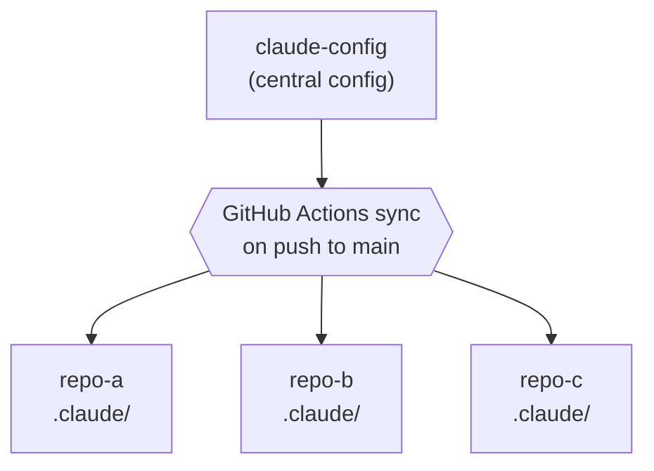

# Claude Config


Centralized Claude Code configuration with security-focused distribution across repositories.

## Features

- **Defense-in-depth security** - File permissions, command blocking, and hookify rules
- **Hub-and-spoke distribution** - Central config synced to all target repositories
- **Automated sync** - GitHub Actions workflow triggers on config changes
- **Standardized environment** - Devcontainer with pre-configured tools
- **Comprehensive testing** - bats-core tests validate all security controls

## Quick Start

### For Target Repositories

Install the GitHub App to receive config updates:

[Install Claude Config Sync](https://github.com/apps/claude-config-sync)

#### Opting Out of Specific Config

Target repos can exclude specific categories or files by adding `.claude/.sync-config.yaml`:

```yaml
# Opt out of entire categories
exclude_categories:
  - commands
  - agents

# Opt out of specific files (basename match)
exclude_files:
  - "hookify.common-block-kubectl-describe-secrets.local.md"
  - "common-tdd.md"
```

**Available categories:** `settings`, `hookify`, `agents`, `rules`, `hooks`, `lib`, `commands`

### For Development

Clone, open in VS Code, and reopen in devcontainer. See [DEVELOPMENT.md](DEVELOPMENT.md) for detailed setup.

## Architecture



See [CLAUDE.md](CLAUDE.md) for detailed architecture documentation.

## Security Layers

This repository implements defense-in-depth with three security layers:

1. **File Permissions** - Blocks access to SSH keys, certificates, credentials, and secrets
2. **Command Blocking** - Prevents commands that could expose secrets (base64, sops, printenv)
3. **Hookify Rules** - Event-based safety controls for Kubernetes, SOPS, and environment access

**Important:** Claude Code uses different pattern syntaxes:

- **Permissions** (`settings.json`) use **[gitignore patterns](https://git-scm.com/docs/gitignore)** - `*` excludes `/`, use `**` for recursive
- **Hookify rules** use **Python/PCRE regex** - standard regex syntax with `\s`, `.*`, etc.

See [CLAUDE.md](CLAUDE.md) for detailed pattern matching reference and common mistakes.

## Usage

```bash
# Manually trigger sync to all repos
gh workflow run "Sync to Target Repos"

# Sync to specific repos only
gh workflow run "Sync to Target Repos" -f target_repos="owner/repo"

# Run tests and linter
./test.sh
./lint.sh
```

## Documentation

- [CLAUDE.md](CLAUDE.md) - Detailed architecture, security layers, and development guide
- [DEVELOPMENT.md](DEVELOPMENT.md) - Devcontainer setup, SSH agent, and tooling
- [.n8n/README.md](.n8n/README.md) - Webhook automation setup with n8n

## Contributing

See [CONTRIBUTING.md](CONTRIBUTING.md) for guidelines on how to contribute.

## License

[MIT](LICENSE)
